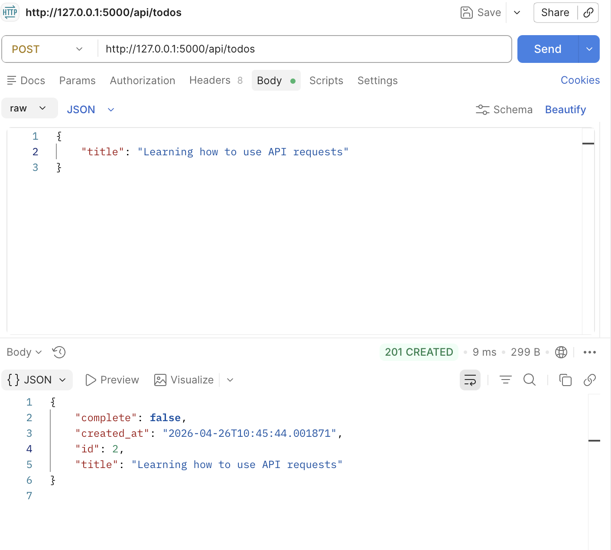
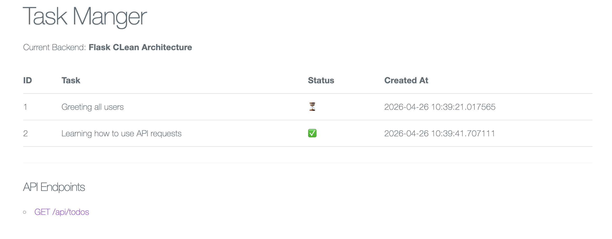

# Python Flask Todo API
A robust RESTful API built with Flask and SQLAlchemy to manage daily tasks. This project covers the full CRUD cycle, including input validation, database migrations, and custom error handling.

## Architecture
This application follows a Modular Flask structure:

- Backend: Python 3.14 + Flask
- Database: SQLite
- ORM: SQLAlchemy for object-relational mapping
- Validation: Custom logic to ensure data integrity before database commits

The flow: Client Request -> Flask Route -> Validation -> SQLAlchemy Model -> SQLite Database

## Getting Started

### Setup Virtual Environment
python3 -m venv venv
source venv/bin/activate  # Mac/Linux
#venv\Scripts\activate  # Windows

### Install Dependencies
pip install flask flask-sqlalchemy

### Run the App
Python app.py

The database file (.db) will be automatically generated upon your first successful request.

## API Endpoints

|  Method  |     Endpoint         |        Description       |   Status Codes   |
| -------- | -------------------- | ------------------------ | ---------------- |
|   GET    |    /api/todos        |      Fetch all tasks     |        200       |
|   POST   |    /api/todos        |       Create a task      |     201, 400     |
|   PUT    |  /api/todos/<id>     | Update completion status |     200, 404     |
|   DELETE |  /api/todos/<id>     |       Delete a task      |     204, 404     |

Example POST body:
{
  "title": "Fix my first API bug"
}

## Error Handling
The API is designed to handle common failures gracefully:
- 400 Bad Request: Triggered if the JSON body is missing or the title is an empty string.
- 404 Not Found: Triggered when attempting to update or delete an ID that does not exist.
- 500 Internal Server Error: Catch-all for database connection issues using try/except blocks.

## Screenshots

### Postman Testing
Example showing a successful POST request with 201 Created status.

### UI Layout
Modern, clean interface with empty-state handling.

## Project Preview

### API Validation (Postman)

### Todo App Interface

